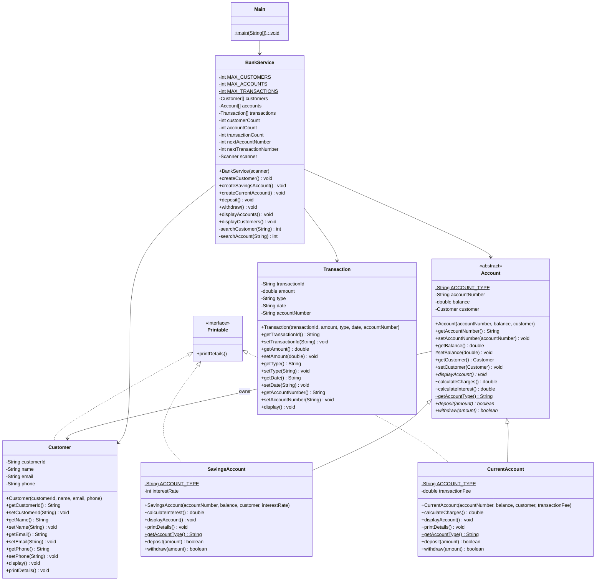

```mermaid
classDiagram
    class Printable {
        <<interface>>
        +printDetails()
    }
    class Customer {
        -String customerId
        -String name
        -String email
        -String phone
        +Customer(customerId, name, email, phone)
        +getCustomerId() String
        +setCustomerId(String) void
        +getName() String
        +setName(String) void
        +getEmail() String
        +setEmail(String) void
        +getPhone() String
        +setPhone(String) void
        +display() void
        +printDetails() void
    }
    class Account {
        <<abstract>>
        -String ACCOUNT_TYPE$
        -String accountNumber
        -double balance
        -Customer customer
        +Account(accountNumber, balance, customer)
        +getAccountNumber() String
        +setAccountNumber(accountNumber) void
        +getBalance() double
        #setBalance(double) void
        +getCustomer() Customer
        +setCustomer(Customer) void
        +displayAccount()* void
        ~calculateCharges() double
        ~calculateInterest() double
        ~getAccountType()$ String
        +deposit(amount)* boolean
        +withdraw(amount)* boolean
    }
    class SavingsAccount {
        -String ACCOUNT_TYPE$
        -int interestRate
        +SavingsAccount(accountNumber, balance, customer, interestRate)
        ~calculateInterest() double
        +displayAccount() void
        +printDetails() void
        +getAccountType()$ String
        +deposit(amount) boolean
        +withdraw(amount) boolean
    }
    class CurrentAccount {
        -String ACCOUNT_TYPE$
        -double transactionFee
        +CurrentAccount(accountNumber, balance, customer, transactionFee)
        ~calculateCharges() double
        +displayAccount() void
        +printDetails() void
        +getAccountType()$ String
        +deposit(amount) boolean
        +withdraw(amount) boolean
    }
    class BankService {
        -int MAX_CUSTOMERS$
        -int MAX_ACCOUNTS$
        -int MAX_TRANSACTIONS$
        -Customer[] customers
        -Account[] accounts
        -Transaction[] transactions
        -int customerCount
        -int accountCount
        -int transactionCount
        -int nextAccountNumber
        -int nextTransactionNumber
        -Scanner scanner
        +BankService(scanner)
        +createCustomer() void
        +createSavingsAccount() void
        +createCurrentAccount() void
        +deposit() void
        +withdraw() void
        +displayAccounts() void
        +displayCustomers() void
        -searchCustomer(String) int
        -searchAccount(String) int
    }
    class Main {
        +main(String[])$ void
    }
    class Transaction {
        -String transactionId
        -double amount
        -String type
        -String date
        -String accountNumber
        +Transaction(transactionId, amount, type, date, accountNumber)
        +getTransactionId() String
        +setTransactionId(String) void
        +getAmount() double
        +setAmount(double) void
        +getType() String
        +setType(String) void
        +getDate() String
        +setDate(String) void
        +getAccountNumber() String
        +setAccountNumber(String) void
        +display() void
    }

    Printable <|.. Customer
    Printable <|.. SavingsAccount
    Printable <|.. CurrentAccount
    Account <|-- SavingsAccount
    Account <|-- CurrentAccount
    Account --> Customer : owns
    BankService --> Customer
    BankService --> Account
    BankService --> Transaction
    Main --> BankService
```
